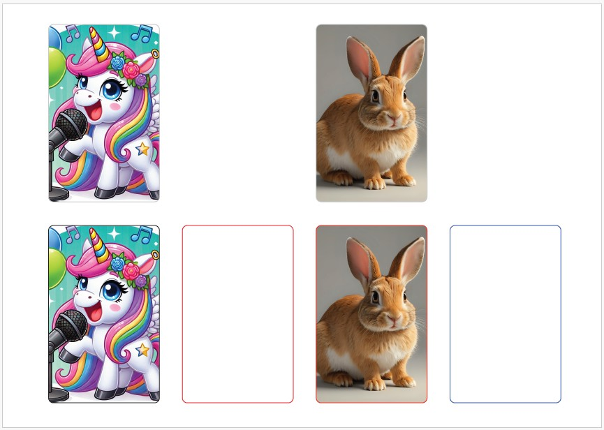

# yotocard.sty

## Prerequisites
You need to have [LaTeX installed](https://www.latex-project.org/get/). If you don't, it's game-over.


## Example code
In a latex document, include the package `yotocard` and then make cards using the command `\yotocard{path-to-card}`.

```latex
% example.tex
\documentclass[a4paper,landscape]{article}
\usepackage{yotocard}
\usepackage[margin=1cm]{geometry}
\pagenumbering{gobble}

\begin{document}
  \begin{flushright}
    \noindent
    \yotocard{examples/unicornwithmic.jpg}
    \emptycardspace
    \yotocard{examples/rabbit.jpg}
    \emptycardspace
    \yotocard[black]{examples/unicornwithmic.jpg}
    \yotocard[red]{}
    \yotocard[red]{examples/rabbit.jpg}
    \yotocard[blue]{}
  \end{flushright}
\end{document}

```

You should be able to create the example file by running:
```
pdflatex example.tex
```
and you should end up with something that looks like this:




## Future work and bugs

Please report any bugs to aja.smith \<at> gmail.com.

- Add title/ subtitle/ image overlay support
- Add support for fixing to card width instead of height
