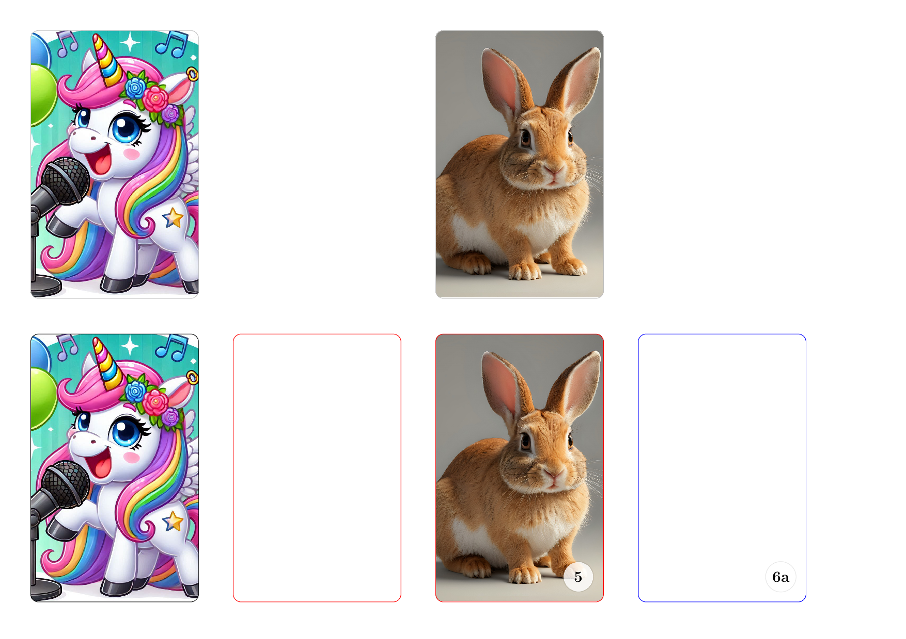

# yotocard.sty

## Prerequisites
You need to have [LaTeX installed](https://www.latex-project.org/get/). If you don't, it's game-over.


## Example code
In a latex document, include the package `yotocard` and then make cards using the command `\yotocard{path-to-card}`.
You can create numbered cards using `yotocardwithnumber{path-to-card}{number}`.
You can create blank spaces that are the size of a card using `\emptycardspace`.
If you want to do something spicy, like add custom text, use `\yotocardwithcustomnode{path-to-card}{custom-node}`.

```latex
% example.tex
\documentclass[a4paper,landscape]{article}
\usepackage{yotocard}
\usepackage[margin=1cm]{geometry}
\pagenumbering{gobble}

\begin{document}
    \yotocard{examples/unicornwithmic.jpg}
    \emptycardspace
    \yotocard{examples/rabbit.jpg}
    \emptycardspace \\
    \yotocard[black]{examples/unicornwithmic.jpg}
    \yotocardwithnumber[red]{examples/rabbit.jpg}{5}
    \yotocardwithnumber[blue]{}{6a}
    \yotocardwithcustomnode[red]{}{\node[
        anchor=south,
        text width=0.9*\cardwidth cm,
        inner sep=2mm
        ] at (0.5*\cardwidth,0)
          {\Huge Example node with custom text};
    }
\end{document}
```

You should be able to create the example file by running:
`
pdflatex example.tex
`
and you should end up with something that looks like this:




## Recommended use case
This is what I do, but you should do what you feel :-)
 - print the pdfs onto a sheet of self-adhesive vinyl inkjet paper;
 - to protect the printed surface, stick a second layer of the vinyl paper over the printed layer
 - cut the cards out
 - stick them to a make your own yoto card (one side of the card is completely white)


## Future work and bugs
- Add support for fixing to card width instead of height

Questions, suggestions and bug reports can be logged at https://github.com/ajasmith/yotocards where you can also find the latest version.


_This file is auto-generated by `generatedoc.ps1`. Do not edit it directly._
